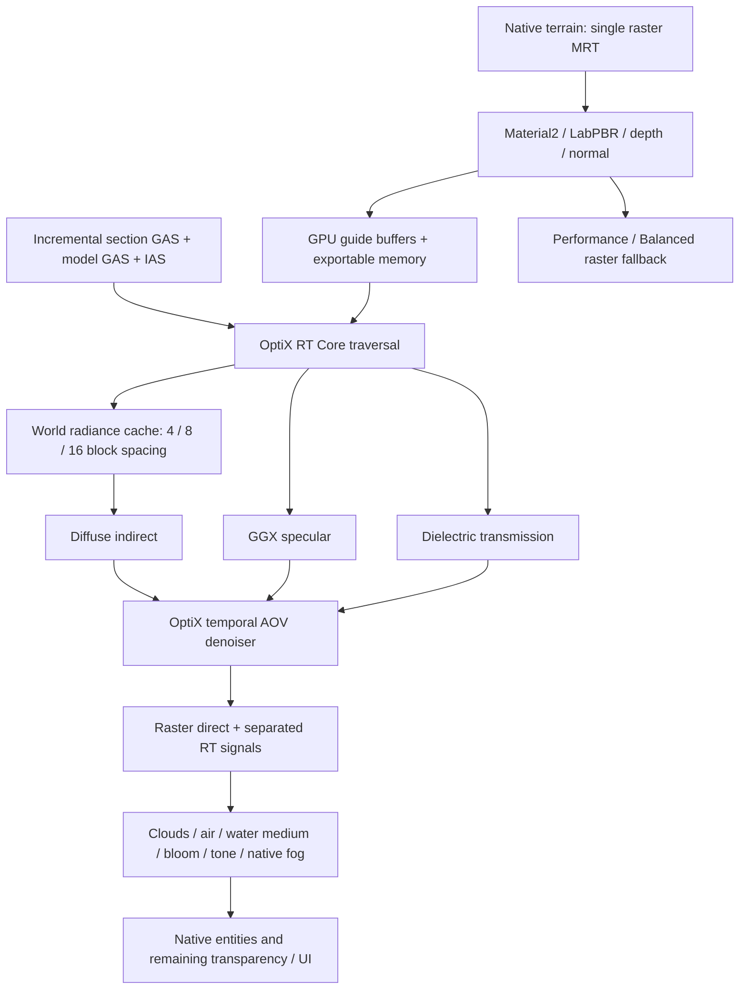

# Raster-primary RTX architecture — 0.36.0

Implementation status: experimental, compiled for Windows/Linux x86-64 against OptiX 9.1 and CUDA 12.9. CPU tests and real GLSL/SPIR-V contracts run on the build host. The host has no NVIDIA GPU or display: RT image quality, synchronization validation, GAS/AABB measurements and FPS acceptance are **not measured**. This document distinguishes the implemented architecture from those acceptance gates.

## Pipeline and ownership



Raster keeps primary visibility, native compatibility, directional direct lighting, held light and surface emission. On an admitted RTX receiver, RT GI replaces hemisphere ambient; static local direct diffuse and its native-light baseline remain raster. Diffuse probe/reference rays exclude first-hit emitter emission to prevent double counting that direct term; RT specular replaces environment/SSR and static local specular. RGB ray visibility replaces scalar directional visibility when transmission is enabled. Direct sunlight is not added again by diffuse GI: sunlight evaluated at a secondary surface is a bounce contribution. Dielectric reflection and refraction are separate specular and transmission AOVs. A low-resolution GPU merge combines the two, replacing the opaque background at that pixel. Native transparent layers behind the RT first interface are suppressed; the first water/glass interface uses that HDR estimate with one display transform.

Coverage is validated against the raster surface. Uncompiled/out-of-budget receivers retain raster lighting. Entities' primary materials currently retain native/raster lighting; captured models participate as secondary RT geometry. Unsupported custom geometry retains native rendering. The old CUDA voxel diffuse backend remains a separately selectable reference, including its CPU staging and bootstrap policy; these are **not** the RTX Quality frame path.

## Module boundaries

- `rt/RtBackend`, `RtTraversalBackend`, `RtSignals`, `RtMaterial`, `RadianceCacheLayout`, `RtInvalidationQueue`: shared semantics and lifecycle/capability contracts.
- `RtxLightingPass`: primary guide export, texture export, bounded scene submission and HDR signal composition. It does not own native terrain compilation or the old PT worker.
- `RtGeometryStream`, `RtTerrainWarmup`: incremental native compiled triangles, loaded offscreen admission, snapshot revision validation. No additional terrain raster or native GPU terrain upload.
- `RtDynamicStream`: captured local posed models, entity/block-entity identity, shared geometry versions and retained offscreen instances.
- `nvidia/ExternalBuffer`, `ExternalSemaphore`, `VulkanCudaInterop`, `OptixNative`: dedicated external allocations, queue ownership and coarse JNI.
- `native/rt/contract.h`, `program.cu`, `bridge.hpp`: common host/device ABI, BSDF/integrator/cache programs, OptiX context/AS/denoiser resource owner.
- `VoxelCloudPass`: cloud targets, march and reconstruction; existing `VisualComposite` composes effects. Lighting and composition remain separate.

## OptiX scene

Terrain uses exact native compiled triangles, including stairs, fences, slabs, cutout foliage, fluids and supported modded baked models. Positions are section-local; IAS provides the section world transform. Each changed section rebuilds its own GAS. A geometry hash excludes packed vanilla light, so LIGHT-only recompilation does not rebuild identical GAS. World unchanged means no terrain AS build. Edits reject old section snapshots and invalidate nearby probes. Unloaded/evicted sections are removed. AS/vertex storage from previous submissions retires behind CUDA events.

Missing loaded sections are admitted outside the camera frustum through one bounded background native compiler. It creates RT triangles only: there is no second material raster and no duplicate native terrain GPU upload. Admission is nearest-first, capped at 512 sections, four completed updates per frame. Resident sections are rechecked against loaded chunks and a bounded camera region. This warms offscreen geometry without making camera rotation the RT scene identity.

Supported opaque/cutout entity and block-entity model submissions are transformed back to local geometry. Identical posed geometry shares a GAS; rigid movement changes IAS transforms; supported same-topology pose changes refit an unshared model GAS. Entity identity and block position persist across render-state extraction. Nearby previously observed entities remain in reflections when offscreen, until removed/unloaded/outside the budget. Offscreen animation uses the last captured pose with current entity translation. Custom/non-model feature geometry and never-captured entities are not yet an independent complete RT scene extraction path.

`rt_benchmark` runs the same 262,144 deterministic rays through identical triangle and custom-AABB cube scenes, ten runs each. It records GPU time, asynchronously compares hit/miss and hit distance, and reports mismatch count/max error. The synthetic benchmark readback is an explicit diagnostic exception. Actual hardware results have not selected a winning representation; production uses accurate triangles, not an unbenchmarked assumption that voxel AABBs are faster.

## Unified material semantics

Primary and secondary surfaces use the same Material2/LabPBR palette: encoded base atlas color is decoded to linear reflectance; smoothness becomes roughness; dielectric F0 and LabPBR conductor IDs use the same optical constants; emission, normal maps and material IDs come from the same authored assets. Secondary hit UVs sample the actual block texture and unlit vertex tint, not map color. Supported entity models use a GPU skin/model atlas and a conservative dielectric profile. Triangle UV derivatives construct a tangent frame for the authored normal map; geometric normal remains separate for medium entry/exit.

The resolved RT material carries base color, shading/geometric normal, roughness, conductor/F0, emission, transmission, IOR, absorption RGB, thin-surface and geometry flags. A material identifier texture labels glass and water without adding full-resolution float attachments. Vanilla clear/stained-glass profiles are included. Resource texture naming identifies glass/water; arbitrary custom transmissive resource naming currently needs that convention. The public `RtMaterial` record defines the common linear optical contract, while the GPU representation is packed palette data plus hit attributes.

GGX uses visible-normal distribution sampling, Smith masking and Schlick Fresnel; secondary dielectric paths choose diffuse/specular lobes with sampling probability compensation. Conductor Fresnel constants match primary PBR. Russian roulette begins after the first bounce. Colored wall bounces multiply linear texture reflectance; metallic surfaces have no diffuse term. There is no brightness bootstrap or display crossfade in RTX Quality.

## Reflection, glass and water

RT specular traces the real bounded scene, including offscreen compiled geometry and retained instances. Roughness changes the GGX distribution; smooth surfaces are not SSR, and rough surfaces are not an artificially blurred mirror. Misses use the environment estimate. Generic raster presets keep HZB SSR.

Glass volume paths use IOR 1.5, stochastic Fresnel reflection/refraction, Snell's law, total internal reflection, radiance-mode eta compensation and a four-medium stack. Water uses IOR 1.333. Beer–Lambert absorption is RGB and measures interface-to-interface distance. Panes use a thin-surface approximation; alpha-test rejection is bypassed for dielectric surfaces, including clear glass texels. Directional visibility traverses up to 16 interfaces and carries RGB transmittance, so stained glass colors transmitted sunlight on diffuse receivers. This is straight directional transmittance, **not refractive focused caustic transport**.

Water and glass share the dielectric integrator. Water uses the same macro/micro normal field and wind clock as raster water, plus independent rain ripples. Three dispersive differently directed long-wave slopes supply macro structure; advected procedural noise supplies micro detail. Raster derivative filtering reduces distant frequencies. These are normal waves, not displaced wave geometry. The raster water volume supplies scattering; RT already supplies absorption, so the RTX post path avoids applying absorption twice. Photon-traced caustics and volumetric multiple scattering are not implemented.

## World radiance cache and new views

Three world-anchored toroidal 8³ grids have 4/8/16-block probe spacing: 1,536 probes total. Each 128-byte record contains a world-position tag/validity, four RGB L1 irradiance coefficients, visibility distance moments, age/update count, relocation offset, luminance moments/variance and generation. Coordinates are absolute world coordinates, not pixels or view matrices.

Every frame updates a limited staggered subset with 8/12/16 rays per updated probe, depending on quality. Moving the camera changes ring admission, preserving overlapping tags; turning does not change it. Inside-solid probes can relocate toward a nearby exit. Lookup interpolates neighboring valid probes with facing and moment-based visibility weights, selecting the first valid cascade. Unknown regions use an explicit environment base until covered; supported nearby cached surfaces therefore do not start at zero on a 180° turn. Refined estimates can still change while previously unloaded geometry warms or lighting changes. This is a bounded irradiance approximation, not instant exact convergence in unknown regions.

Block/light/geometry events coalesce into local invalidation boxes independent of the old 125-section tracker. Dimension/resource changes replace the RT context. Projection/target resizing currently recreates interop resources and cache; ordinary camera translation/rotation does not globally clear it. The old `PathTraceSurfaceCache` serves the CUDA reference only.

## Signals and temporal denoising

Diffuse, specular and transmission have independent RGBA32F observations and separate OptiX AOV types. For dielectric pixels, the first interface replaces the opaque-background guide before temporal processing. World-space guide reprojection produces SDK-direction previous-to-current pixel flow and trustworthiness based on normal/position agreement. Previous denoised AOVs and internal guide banks ping-pong. First-frame/option-change inputs do not claim valid previous layers. A separate low-resolution merge adds dielectric specular to transmission for water/composition; it does not collapse the tracer/denoiser signals. Transmission alpha carries the first dielectric hit distance and is copied, not filtered as an opacity estimate.

The OptiX temporal AOV model is used instead of extending the old display EMA/transition chain. `rt_denoiser off` exposes raw signals. Opaque TAA can remain enabled when RT replaces SSR. Specular/transmission use the SDK's different AOV semantics but currently share primary-surface/interface flow; no reflected/refracted hit-motion flow or complete animated-object velocity buffer exists. Motion ghosting must be tested. NRD/ReSTIR were not added: an existing SDK temporal model gives a smaller, testable integration; their later adoption requires measured need and signal/hit-distance contracts.

## Vulkan/CUDA synchronization

Optional external-memory/semaphore device extensions are enabled only when supported. Vulkan physical-device UUID is matched to CUDA; mismatches fail to raster. VoxelLight owns dedicated, device-local, exportable buffers from creation. Ordinary Mojang textures are never retroactively exported: graphics copies primary guides and atlas images into the shared buffers.

Per frame: Vulkan writes guides → graphics-to-EXTERNAL ownership barrier → signal `ready` and submit → CUDA waits `ready`, traces/denoises → signal `done` → Vulkan waits `done`, EXTERNAL-to-graphics barrier → GPU buffer-to-texture copies and HDR composition. Two binary semaphores have explicit single ordered producer/consumer ownership. Windows handles are closed after import; successful CUDA FD imports own their FDs. CUDA imports are destroyed before Vulkan resources are deferred for destruction.

Normal RTX frames do not read image data to the CPU or upload image results from it. CPU scene geometry/transform/parameter batches are ordinary AS inputs; GPU atlas/guide/signal exchange remains GPU-only. Normal frames do not call `vkDeviceWaitIdle`, `cuStreamSynchronize` or wait on an event. Context shutdown synchronizes the CUDA stream to retire resources. Benchmark-only hit comparison uses asynchronous diagnostic readback.

Official contracts: [CUDA graphics interop](https://docs.nvidia.com/cuda/cuda-programming-guide/04-special-topics/graphics-interop.html), [CUDA external resources](https://docs.nvidia.com/cuda/cuda-driver-api/cuda_driver_api/group__CUDA__EXTRES__INTEROP.html), [OptiX denoiser API](https://raytracing-docs.nvidia.com/optix9/api/group__optix__host__api__denoiser.html).

## Clouds and atmosphere

Quarter-resolution clouds march 24 jittered samples through 8×4×8 macro-cell density. Discrete column heights preserve stepped Minecraft silhouettes; procedural erosion softens edges/interiors. Three density queries estimate sun transmittance per occupied step. Camera-aware cloud history reconstructs the premultiplied HDR result. Native clouds remain the fallback. Cloud density is shared conceptually and mathematically with projected raster/RT sun transmittance; this is a procedural volume, not full cloud path tracing. Miss/reflection environment still uses a cheaper sky estimate.

Aerial density defaults to **0.00035**, volume density to **0.001**, forward-scatter strength to **0.35**. Separate runtime controls prevent reducing god rays merely because aerial haze is weaker. These numerical defaults are implemented; a perceived one-third visual strength still requires the same scene/weather comparison.

## Budgets and presets

| Resource | Bound |
| --- | --- |
| RT guides/signals | At most 640×360; usually quarter resolution or smaller |
| Vulkan shared buffers | 256 MiB total creation cap, including atlases |
| CUDA scene/cache/denoiser/retired allocations | 512 MiB total cap |
| Denoiser state + scratch | 192 MiB cap, also inside CUDA total |
| World probe records | 196,608 bytes |
| Static GAS | 512 sections, at most 600,000 vertices/section |
| Dynamic GAS/IAS submissions | 64 selected models, 2 MiB Java capture/frame |
| Model texture atlas | 2,048² RGBA8; 64 tiles of 256² |
| Cloud history | Two quarter-res RGBA16F targets; 16 MiB cap |
| HDR RTX composition | One full-res RGBA16F target plus one low-res RGBA32F dielectric merge |

CUDA memory status includes allocation retirement pressure. Source atlases are clamped to 2,048 resolution; static secondary textures update on resource reload. Animated secondary texture refresh, allocation aliasing, complete distant RT scene and full dynamic feature extraction are limitations. Hitting a budget fails safely to raster rather than claiming an active incomplete context.

Performance/Balanced keep the raster pipeline. `RTX Quality` selects OptiX traversal, all three signals, world probes, temporal AOV denoising and voxel clouds. Cinematic is a reserved primary-ray interface/command, not a silently enabled full PT mode. The existing adaptive GPU-world controller lowers sample/probe quality after sustained over-budget observations and restores it after sustained headroom, bounded by the selected ceiling; it does not silently switch the tracer or rebuild the scene.

## Profiling, debug and A/B

`profile on` and `profile export` include delayed GPU timings and CPU submission times. CUDA event queries do not wait. Passes: `rt_as_build_update`, `rt_primary_guides`, `rt_scene_submit`, `rt_instance_submit`, `rt_radiance_cache`, `rt_diffuse`, `rt_specular`, `rt_transmission`, `rt_denoiser`, `rt_dielectric_merge`, `rt_composite`, `voxel_cloud`, and both geometry benchmark passes. `status` includes section/GAS/IAS counts, CUDA-owned bytes, retired allocations and staging state.

Commands:

```text
/voxellight preset performance
/voxellight preset balanced
/voxellight preset rtx_quality
/voxellight rt_backend raster|optix_rt|cuda_voxel_reference
/voxellight rt_gi on|off
/voxellight rt_reflections on|off
/voxellight rt_transmission on|off
/voxellight radiance_cache on|off
/voxellight rt_denoiser on|off
/voxellight voxel_clouds on|off
/voxellight rt_debug off|diffuse|specular|transmission|albedo|roughness|metal|material_transmission|ior|normal|material|cache_validity|cache_age|cache_cascade|scene_coverage|glass_transmittance|water_absorption
/voxellight cloud_debug off|density|macro_cells
/voxellight atmosphere_density 0.00035
/voxellight volume_density 0.001
/voxellight forward_scatter 0.35
/voxellight rt_benchmark
```

## Acceptance and benchmark methodology

Use the same seed, camera route, resolution, render distance, weather/time and resource pack for A/B. First allow loaded offscreen scene admission; record status so missing GAS is not mistaken for a tracer defect. Capture 30 seconds after warmup; export raw pass and world-region measurements, summarize p50/p95 with `tools/benchmark_summary.py`. Separate fixed-view, fast movement and region-load tests. Never substitute FPS guesses for exported measurements.

1. White room with red/blue/green wool walls: visible natural linear color bleeding, no energy explosion; 180° turn within warmed cache should have an immediate estimate, not a black bootstrap.
2. Iron/gold/copper/LabPBR smooth floor: offscreen buildings/entities remain in RT reflections; rough metals broaden the stochastic lobe; denoiser on/off reveals signal ownership.
3. Clear glass, panes, red/blue and stacked colored glass: reflection/refraction/Fresnel, RGB light on white receivers; no doubled native transparency.
4. Shallow/deep/underwater/coast/rain/sunset water: consistent dielectric reflection/refraction, absorption once, animated two-scale normals, independent rain and no obvious periodic bands.
5. Midday/sunset/storm/cloud flight: stepped macro silhouettes with fuzzy edges, coherent shadows, cloud debug density and macro cells.
6. Compare aerial density against 0.35.2 with identical settings; lower haze while volume/forward controls remain independent.
7. Edit/unload/reload/F3+T/dimension/resize/RTX toggle: only relevant GAS/probes update; no stale meshes, destroyed textures or queue ownership errors. Run Vulkan validation on NVIDIA hardware.
8. Run triangle/AABB diagnostic: compare p50/p95 and `rtBenchmarkMismatches=0`; measure synthetic rays/s separately from actual scene performance.
9. Profile all three signals, denoiser, scene updates, clouds and composite; compare every A/B switch and verify `rtCpuStaging=false` only for the active RTX path.

All nine GPU acceptance groups remain pending on this build host. Full primary-ray PT, physically focused caustics, arbitrary transmissive mod conventions, perfect offscreen animated poses and full RT volume scattering are not claimed by 0.36.0.
