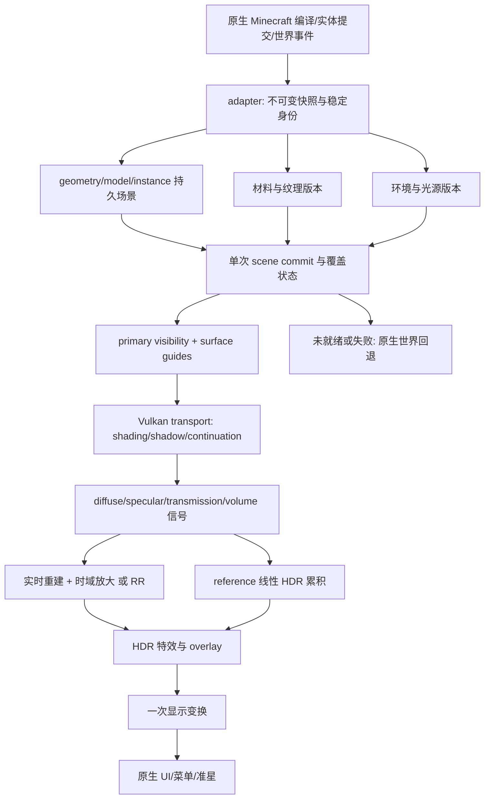

# VoxelLight 系统架构调整设计

日期：2026-10-06。基线：**0.39.0-alpha.23，提交 `52dd802`**，Minecraft 26.2 / Java 25 / Fabric / 原生 Vulkan。状态：**设计提案，未实施**。本组文档是当前 PT 路线的架构设计入口；旧 raster-primary / OptiX tracing 文档保留为历史。本文中的新增结构、配置及 ABI 均为目标合同，不表示当前代码已经提供。

## 1. 核心决策

将现有原型调整为：**原生 Minecraft 数据适配 → 持久、分页的三角形场景与稳定实例 → Vulkan 路径追踪 → 分信号重建及真正的时域放大 → 统一 HDR 合成 → 原生 UI**。

保留已有 Material 3、BSDF/PDF/MIS、环境采样、Slang 数值校验、Vulkan camera-primary 与 reference 累积。首先改变数据生命周期和帧提交方式，再改变 GPU 工作组织；不整体重写项目，不恢复已经删除的 CUDA/OptiX tracer。

实时路径以低 spp 和正确运动信号为基础，允许明确标注的有偏重建/缓存。Reference 共用场景、材质和物理积分核心，但关闭时间重采样、降噪、缓存终止与显示侧限幅，用于定位算法偏差。Reference 仍受实际场景覆盖与路径截断限制，不能称无限世界的绝对真值。

### 已决定与待测量的边界

| 项目 | 决策 | 必须测量后才确定的部分 |
|---|---|---|
| 主后端 | Vulkan 硬件三角形 PT；光栅用于回退、guide/overlay 的受控用途 | 是否启用输出分辨率光栅 guide |
| 场景 | section-local 地形、model-local 动态网格、稳定实例/分配 | 小 section 合并阈值、动态 AS rebuild 周期 |
| AS | 持久资源、帧内一次 commit、合规 refit、统一预算 | 原地/多缓冲策略的设备性能 |
| 追踪 | 先 opaque/cutout 分类和状态拆分，再分离 shadow 与压缩队列 | compaction 阈值、材质分桶粒度、SER/OMM |
| 光源 | 独立手持源、增量 emitter、空间层级 proposal | ReSTIR DI 收益及 reservoir 参数 |
| 重建 | 正式 surface/motion/signal ABI，降噪与放大分开 | NRD/OptiX/RR 的质量与成本排序 |
| 水/玻璃 | 统一几何界面、介质与透明合同 | 复杂体积、焦散方案的质量预算 |
| 世界范围 | 已加载 section 的精确场景；缺页显式标记 | 远景代理及辐亮度缓存的接入时机 |

## 2. 现状审计与证据

现状来自源码和 [alpha.21–23 性能分析](../performance/ALPHA-23-ANALYSIS.md)，不是由类似项目的效果反推本项目能力。

| 现有组件 | 已具备 | 需要调整 |
|---|---|---|
| `VulkanPathTracer` | camera-primary、五次 continuation、批量 spp、实时/reference、失败回退 | collect/commit/render 分开；显式 frame context；输出策略从整数 scale 走向合同化 |
| `RtGeometryStream` / `RtTerrainWarmup` | 原生编译地形、后台 warmup、版本校验、页面请求 | 稳定 allocation、覆盖状态、背压和优先级 |
| `VulkanRtScene` | section BLAS、动态同大小 refit、TLAS、shader geometry、emitter | update 内立即 TLAS；紧凑索引；静态 emitter 随动态重建 |
| `VulkanRtAccel` / `VulkanRtBuffer` | Vulkan 构建与延迟销毁 | UPDATE 仍新建目标/storage/scratch/vertex buffer；需持久容量和池 |
| `RtDynamicScene` / `DynamicModelBuffer` | 实体/方块实体/手持/自定义 quad/cutout 粒子；UV crop 修复 | `RtModel` 当前仅 quads/texture，缺对象 ID、局部模型、上帧姿态；纹理每帧复制 |
| `material_transport.slang` | NEE/MIS、GGX、介质栈、独立 held、火焰 RIS、RR 终止 | 432-byte 全状态；固定尺寸 dispatch；多次 shadow/24 层透射处理；opaque 也进入 any-hit |
| `RtReconstruction` / OptiX helper | 稳定中心 guide、相机重投影、beauty 去噪、Vulkan 回退 | 动态历史保守拒绝；缺独立 specular/transmission 运动；最终 LINEAR 放大 |
| 既有 raster effects | 阴影/AO/水/云/体积/合成 | PT 激活时 alpha.21 已跳过多数准备；需固定 owner 合同，避免未来重叠 |

alpha.23 记录：内部 **214×120 / 最终状态 1 spp**，world CPU/GPU 中位 16.320/15.443 ms，world GPU P95 21.803 ms，RT batch 10.637 ms，OptiX exchange 1.828 ms。当前导出缺真实 frame ID、dispatch 尺寸/spp；父子 scope 重叠且三次采集未控制场景/时钟。因此这些数值只指导优先级，不能相加算 FPS，也不证明某一硬件单元受限。

当前 64 MiB GPU scene working set 不等于全部显存，256 MiB 压缩 CPU page cache 不等于完整世界；自动内部尺寸至少线性缩小 4 倍，且上限 640×360。文档不能把它写成已经具备生产级 1080p 重建。

## 3. 类似项目如何影响本设计

### 3.1 SEUS PTGI：借鉴世界表达与美术目标

作者说明 PTGI 使用自定义软件光线追踪，提供 GI 和反射，不要求 RTX；其接入背景是 shaderpack。[Sonic Ether 官方说明](https://www.sonicether.com/seus/)

**本设计的推论**：Minecraft 可以利用区块局部性、重复材质和有界世界表示控制成本；画质目标还需要日夜氛围、材质可读性与连续水面。当前已经拥有硬件三角形后端和原生复杂方块形状，主路径继续使用它；不以整方块体素替代楼梯、栅栏、门、流体和 mod 模型。体素只在未来作为保守 occupancy、远景代理或 cache 定位辅助。没有审阅 PTGI 闭源实现，不宣称其内部使用本设计的实例、MIS 或 reservoir 算法。

### 3.2 Caustica：借鉴完整输出链与接管边界

查阅的是 [ComfyFluffy/Caustica 上游 README](https://github.com/ComfyFluffy/Caustica)，公开列出 Vulkan PT、DLSS RR、实验性 FG、HDR、动态实体、LabPBR、OMM/SER。上游仍将维度环境、NRD/FSR、LOD、ReSTIR 列为后续事项。这证明它提供了相关路线的公开实现入口，不证明每种场景或设备均通过验收。

[PEQHUB 分支](https://github.com/PEQHUB/Caustica)另外描述 EON/GGX 能量和 SDR/HDR 改进；这些分支内容不归入上游默认行为。本次对 Caustica 的依据为公开项目说明与目录，不是完整 shader/同步源码审计，不据此断言其 AS 生命周期或具体采样算法。

**本设计的推论**：RR、动态物体、HDR 和世界接管必须作为同一条数据链设计；尤其不能把 RR 当成在 beauty 输出后随意添加的滤镜。我们先补本项目信号与生命周期，再选择 SDK；不复刻其平台约束、功能列表或未经本项目验证的优化。

### 3.3 其他渲染器经验

- PBRT wavefront 讨论通过任务队列控制 GPU 分歧，也存在队列读写开销；本项目逐步拆 hot/cold state 和 shadow，不立即给每种材质创建独立 dispatch。[PBRT GPU 映射](https://pbr-book.org/4ed/Wavefront_Rendering_on_GPUs/Mapping_Path_Tracing_to_the_GPU)
- NVIDIA RT 指南支持复用 AS、管理 scratch 和减少不必要 any-hit；Vulkan UPDATE 的合法性以规范为准，不能仅用顶点数相等判断。[RT 实践](https://developer.nvidia.com/blog/best-practices-for-using-nvidia-rtx-ray-tracing-updated/)、[Vulkan AS 规范](https://docs.vulkan.org/spec/latest/chapters/accelstructures.html)
- RTXDI 提供 DI/GI/PT 的重采样实现及 application bridge。先解决稳定 light/surface ID、运动、PDF 与可见性，再实验 DI；GI/PT 不作为第一轮默认依赖。[RTXDI](https://github.com/NVIDIA-RTX/RTXDI)、[bridge 合同](https://github.com/NVIDIA-RTX/RTXDI/blob/main/Doc/RtxdiApplicationBridge.md)
- NRD 面向 opaque 表面的低 spp 重建，需要法线、roughness、viewZ、motion 及相应信号；透明/体积需另外设计。[NRD 集成说明](https://github.com/NVIDIA-RTX/NRD)
- RR 要求材质、相机和输入资源合同，并承担自身的重建/放大；不能串联默认 NRD + RR + SR。[Streamline RR 指南](https://github.com/NVIDIA-RTX/Streamline/blob/main/docs/ProgrammingGuideDLSS_RR.md)

## 4. 总体数据流和职责

沿用现有包：`world` 提供世界语义，`adapter` 承担版本相关 hook/捕获/帧编排，`rt` 承担纯合同与策略，`rt/vulkan` 承担 Vulkan 资源与命令，`nvidia`/`native/denoiser` 承担可选重建桥，`shaders/rt` 承担积分核心。不开第二套工程，不引入通用 ECS 或自制 render-graph 框架。

| Owner | 唯一负责的状态 | 禁止由它触发的操作 |
|---|---|---|
| `WorldSceneBridge` + geometry stream | section revision、加载/卸载、immutable snapshot | 工作线程持有原版 GPU 指针 |
| `RtDynamicScene` | 对象捕获、model/pose/transform、纹理引用 | 每捕获一组就 rebuild TLAS |
| `VulkanRtScene` | allocation、AS、instance、提交后的 scene snapshot | 将 texture tile ID 当 mesh 身份 |
| `VulkanRtMaterialAssets` | 材料/纹理/光源/环境资源版本与上传 | 相机运动推动全部资源重建 |
| `VulkanRtContext` | 帧内 RT 命令、path queues、signals | SDK 去噪、显示变换 |
| `RtReconstruction` | 历史、信号转换、后端选择、放大 | 回写物理材质或伪造运动 |
| `VulkanPathTracer` | 模式、frame context、成功显示与回退 | 直接维护每个 section 的 Vulkan allocation |
| `VisualComposite` / 最终 PT 合成 | HDR overlay、bloom、exposure、display | 再加 raster direct/AO/水反射或二次 fog |

模块以具体数据结构和明确方法交互；仅重建已有多个真实后端的部分保留接口。文中 owner 职责不意味着每一行必须新建一个 Java 类。

## 5. 帧合同

1. `beginFrame`：分配真正的 render frame ID；记录 tick/partialTick、world/resource epoch、相机、jitter、实际内部/输出尺寸、请求与实际 spp、GPU 完成状态。
2. `collect`：汇总地形变动、动态 pose/transform、材质动画、灯光和环境；期间只生成 pending delta。
3. `plan`：按覆盖优先级、上传/AS 时间预算和峰值显存决定本帧能提交什么；未完成更新显式 pending。
4. `commit`：批量上传、BLAS build/refit、实例更新、必要时一次 TLAS build/update，发布同版本材质/光源 snapshot。
5. `trace`：primary + guides，按所选调度积分。所有 shader 只读本帧已提交场景；不在中间接受工作线程新页。
6. `reconstruct`：选择一条后端路径，执行对应历史及输出合同。
7. `compose`：受控 HDR overlay/天气/显示；成功后标记哪些 native draw 已被替代。
8. `retire`：以原生 submission 完成信息释放在途资源，异步读取指标/page requests，结束 frame。

全帧 light/material/AS 必须引用同一提交视图。正常场景一帧最多一次全局 TLAS 构建命令；完全不变时为零。Reference freeze 锁定时间、姿态、纹理和灯光，而编辑/卸载/世界切换触发 reset 或退出 freeze，不能继续展示已删除的世界作为当前帧。

## 6. 世界接管与功能覆盖

PT 成功接管时：primary visibility、直接光、GI、反射/折射、介质衰减和水面由 PT 管理；原生 lightmap/AO 不作为 BSDF 的入射光叠加。Native tint、blockstate、模型 UV 和贴图保留。伤害 tint/破坏纹理属于表面效果；准星/UI 属于显示层。

| Minecraft 特性 | 目标处理 | 首期边界 |
|---|---|---|
| 楼梯/栅栏/门/流体/mod baked model | 编译三角形与原生 alpha；编辑增量替换 | 无猜测全立方体几何 |
| 实体/箱子/旗帜/盔甲/手持 | 稳定对象 + model-local pose + instance transform | offscreen 未独立捕获时显示陈旧姿态指标 |
| cutout 树叶/草/火焰 | alpha coverage 与双面材质；shadow 同合同 | 不一律 opaque；OMM 后置 |
| 水/玻璃/冰 | thin/solid/medium 明确区分、统一路径 | 波浪先 shading normal；reference 独立介质校验 |
| 半透明/加法粒子 | cutout 可 PT；blend/additive 首期 HDR overlay | 不假称 overlay 进入所有反射 |
| glint/outline/破坏阶段/标签 | 明确表面或 HDR/display overlay owner | 每类只绘制一次；默认不用 PT 材质近似全覆盖 |
| Overworld / Nether / End | 维度 environment profile | 未支持维度保留原生世界，不套主世界太阳 |
| reload/切世界/resize/backend off | epoch + 帧完成保护 + 所属历史重置 | 不依赖强制每帧 device idle |
| Sodium/Iris/其他重写 renderer 的 mod | 指定版本 hook 兼容矩阵 | 未经验证不宣传普遍兼容 |

## 7. 详细设计与实施顺序

1. [场景、实例、资源与 Minecraft 数据合同](SCENE-AND-RESOURCES.md)：身份、数据布局、页面状态、AS 池、同步、纹理、卸载与缺页。
2. [材质、路径追踪、光源与介质](TRANSPORT.md)：BSDF、估计器、MIS、状态/队列、透明、水/焦散、缓存。
3. [运动信号、重建、放大与输出](RECONSTRUCTION-AND-OUTPUT.md)：AOV ABI、动态运动、后端转换、历史失效、HDR、overlay。
4. [迁移任务、性能预算与验收](MIGRATION-AND-VALIDATION.md)：按当前文件落实的改造步骤、基线、测试场景、决策门槛。

顺序：**可靠测量 → 持久场景 → 稳定实例/对象运动 → transport 精简与光源增量 → 分信号重建/放大 → ReSTIR/缓存/焦散/OMM/SER 实验**。重建合同可提前定义，接入必须等数据正确。FG 最后考虑；它不解决低基础帧率、运动错误或场景 CPU 成本。
