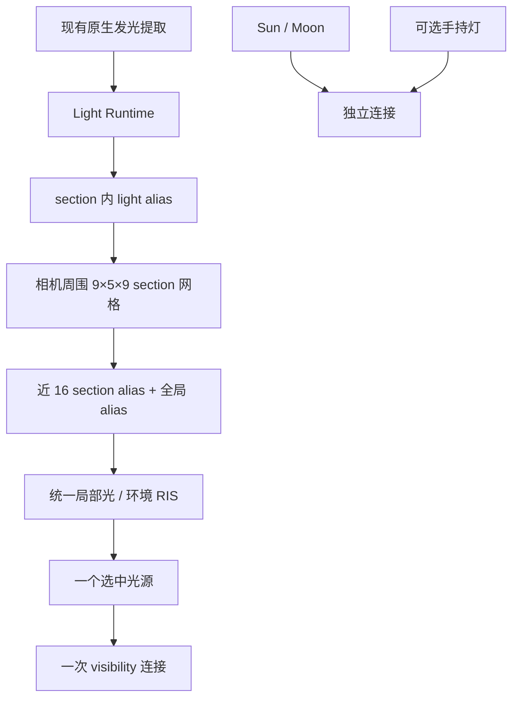

# alpha.34：统一直接光与单次 RIS visibility

这一轮重构直接光执行层。Sun/Moon 保持独立有限圆盘采样，手持灯保持可选独立点光连接；原生火把、灯笼、其他原生发光三角形及环境光进入同一个 fresh RIS reservoir。候选阶段只计算 proposal、材质和未遮挡贡献，最终仅对选中的一个候选调用 visibility。每次有效 surface hit 最多三个直接光连接，深层通常更少。玻璃/水的一个连接仍可能追踪多个界面，不能把连接数称为实际 TraceRay 次数。

## 数据与执行



复用现有 `RtEmitterTable` 的源选择和辐射标定，合并原来独立的 flame 和 emitter proposal。表内点光与面积光通过类型区分，triangle ID 排序支持命中 PDF 二分查找。每个 section 有按原生发光质量加权的 light alias；网格 cell 按 section 中心距离选择附近 16 个 section，以质量除以距离平方加 256 建立上层 alias。构建使用 bounded heap，避免每个 cell 对全部 section 排序。

网格内 section proposal 是 80% 局部与 20% 全局混合，网格外使用全局表。全局分量保留所有表内远处光源的支持。环境 family 占 20%，局部光占 80%；没有局部光时环境占 100%。面积光从三角形均匀取点，读取实际 Material 3 发光与 cutout；点光保留原来的平方反比和源模型自遮挡处理。源选择上限仍是现有最多 8192 个 stochastic records 加 16 个 flame records；材质定义发光但原生等级为零、未加载区块等现有源覆盖限制没有在本轮消除。

Light Runtime 使用独立 64B header、64B 光源记录、32B section 节点、16B alias 项，GPU assets header 从 208B 扩展至 256B，追加 2MiB 有界 runtime 区域。仅源集合、相机 section 或 adaptive revision 改变时重建上传；自适应刷新至少间隔 64 帧。不增加 BLAS geometry，不增加 RT stage 数。

## RIS、MIS 与深层预算

| 来源 bounce | 候选数 K | local/environment NEE 存活率 s |
| --- | ---: | ---: |
| primary 0 | 8 | 1 |
| secondary 1–2 | 4 | 1 |
| 3 | 1 | 0.5 |
| 4–5 | 1 | 0.25 |

Sun 与手持灯不参加这次 NEE roulette。深层没有完全关闭点光采样：点光没有连续 BSDF 命中策略，直接关闭会改变能量。保留下来的样本乘以 `1/s`。

候选完整 proposal 为 q，目标为未遮挡 RGB integrand 的 luminance。表面 integrand 已包含 BSDF、cosine、辐射与 MIS；介质使用原有单次散射相函数。reservoir 权重为 `target/q`，最后贡献为：

```text
selected RGB integrand × sum(candidate target/q) / (K × selected target × s)
```

先做 weighted reservoir selection，再乘实际 visibility。给定候选集合，reservoir 的期望恢复各候选贡献的平均，roulette 的 `1/s` 恢复未跳过时的期望。候选 target 不复用可见性或历史 radiance。

非 delta 表面候选的 power MIS 使用 `K × s × q` 对 BSDF PDF。BSDF 命中 emitter 或逃逸到环境采用同一竞争 PDF 与互补权重；Sun 的竞争 PDF 单独为有限圆盘 `1/solidAngle`，手持与点光不与连续 BSDF 配对。终止 bounce 没有后续 BSDF 样本，NEE 的 MIS 权重为 1。前一 hit 的 proposal cell token 存入已有 `PathHot.reserved`，避免偏移后的 origin 跨 section 边界导致命中 PDF 选择不同网格；PathHot 保持 **64B**。

候选 family 使用 24-bit base-2 radical inverse 和按 prefix 的 Owen scramble，返回值严格位于 `[0,1)`。reservoir replacement 使用独立 RNG，避免低差异候选序列与条件选择混用。直接光 RNG 从 continuation RNG 独立派生，legacy 与 RIS A/B 使用同样的 BSDF/RR 随机链；这一拆分使单帧噪声不同于 alpha.33，但不改变旧路径的积分目标。

## 时间自适应

使用 6-bit fixed-point sum 避免高分辨率下 uint feedback 溢出，每 32 帧抽样反馈选中局部光的 visibility ratio，按 section hash 分为 8 个 bucket。至少 16 次观测后，用 0.15 EMA 更新 proposal factor，限制在 `[0.25,1]`，防止遮挡较多的光源失去支持。旧源 generation 的延迟反馈被拒绝。因子只改变 proposal，实际 PDF 同步更新；不会复用旧 reservoir、radiance 或 visibility。这里是时间自适应 proposal，不是完整 ReSTIR temporal/spatial reservoir reuse。

## 操作与验收

alpha.34 的 PT 默认直接光为 RIS；全新安装 effects 仍关闭。手动切换：

```text
/voxellight rt_direct legacy
/voxellight rt_direct ris
/voxellight rt_benchmark direct
```

专用 direct 测试只运行两轮 ABBA，共 8 段，默认每段 10 秒采样，另有预热、稳定检查和 drain。`direct 15` 延长采样，允许 4–30 秒。保持站定、关闭菜单；结束或 stop 自动恢复原控制。A=legacy，B=RIS；两侧固定相同 visibility（支持时 Query）、Fixed queue、OMM/SER off。完整 `start` 现在最多 64 段，direct 比较排在旧执行层比较之后。

导出的 summary schema 6 包含实际 Direct mode。每段新增 `.direct_lighting.json` 与 rays CSV 列，分别提供每个 bounce 的 surface hits、surface visibility connections、RIS candidate 和 selected 数。connections/hits 验证工作减少；candidate/selected 包含介质事件的 RIS 工作，surface connection 分母仅用于表面。原来的实际 shadow ray / any-hit 指标保留；玻璃水多界面会使 shadow ray 数大于 connection 数。耗时仍从无诊断计数器帧统计，计数器/回放及自适应反馈帧被排除。

重点比较 transport scope sum、visibility、bounce1/2；只有有效且超过两轮波动的结果才能判断提速。目标 `Tnew/Told=0.5–0.7` 是实机目标，构建主机没有 NVIDIA GPU，不能把候选数减少直接当作已达到该速度。对照 reference 多 spp 检查室内彩色光、远处发光面、日夜环境、玻璃水、手持灯开关及移动时噪声/亮度；单帧 RGB 不应要求逐像素一致。

验证包含实际 Java runtime builder → binary assets → 生产 Slang CPU target：彩色遮挡点光、双三角形面积光、环境混合、自适应 proposal、各深度 roulette、匹配 emitter hit PDF，以及表面 NEE+BSDF 的联合 MIS 能量回归。每个 case 200,000 样本，RGB 期望误差阈值 2%；没有替换成测试专用 RIS 实现。另检查 proposal 支持、alias histogram 和 continuation cell token roundtrip。这些验证不能替代 RTX 帧时间、寄存器/cache 或实际场景外观验收。

参考：[NVIDIA reservoir resampling 论文](https://research.nvidia.com/publication/2020-07_spatiotemporal-reservoir-resampling-real-time-ray-tracing-dynamic-direct)、[PBRT 的 NEE 与互补 MIS](https://pbr-book.org/4ed/Light_Transport_I_Surface_Reflection/A_Better_Path_Tracer)。上面的混合 proposal、深层 roulette 和本项目 ABI 是结合现有执行链的实现设计。
